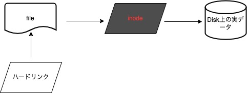
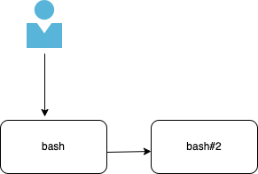
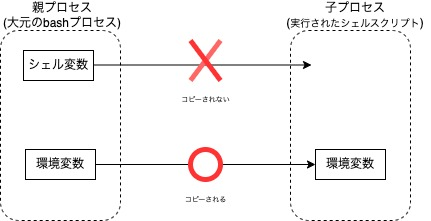

# 前提

## 各種プロファイルについて
- 下記ファイルがある

|順番|ファイル名|範囲と実行タイミング|用途|
|:-----|:-----|:-----|:-----|
|1|/etc/profile|全ユーザ。ログイン実行時(ログインシェル)|システム全体に関わる初期設定|
|2|/etc/.bash_profile|各ユーザ。ログイン後に実行(非ログインシェル)|各ユーザの個別設定。この中で.bashrcが呼ばれる|
|(2)|/etc/.bashrc|各ユーザ。ログイン後に実行(非ログインシェル)|各ユーザの個別設定|
|4|/etc/profile|各ユーザ。ログアウト時|ログアウト処理時に実行するもの。デフォルトではなし|

## プロンプトで利用する変数

- プロンプトを構成する変数
    ```
    $ echo $PS1
    $ [\u@\h \W]\$ ※デフォルト 
    ```

- PS1変数を構成している要素
 ※使えそうなものだけピックアップ
  - `\h` ・・・　ホスト名
  - `\u` ・・・　現在のログインユーザ名
  - `\t` ・・・　時間 ※osのタイムゾーン設定による
  - `\W` ・・・　作業中のディレクトリ

## ハードリンク、シンボリックリンク

- ハードリンク


- ファイルのinodeに対するリンク
- ファイルの属性情報を持つ。同じ属性情報を持つファイルが削除されても残り、アクセス可能
- ディレクトリに対しては不可
- バックアップ用途で利用される。cpなどでコピーしたものはディスク容量を食うがこちらは違う
- 作成コマンド
```
$ ln test.txt hardlink.txt
$ ls -i1
同一inodeになっている
```

- シンボリックリンク



- ファイルそのものに対するリンク
- ファイルそのものを削除すると実データも削除されるため、アクセスできなくなる
- ディレクトリに対しても可能
- ショートカットの用途で利用される
- 作成コマンド
```
$ ln -s test.txt symbolic-link.txt
test.txt
symbolic-link.txt -> test.txt
```

## プロセス管理

- プロセス管理

./(シェルスクリプトファイル)を実行するとbashの中で子プロセス(bash)が呼ばれスクリプトが実行される

  


## シェル変数と環境変数

### 各変数の違い<br>

シェル変数: 利用中のシェルの中だけで利用可能 <br>
環境変数: シェルの中で立ち上げられた子プロセス(実行されるシェルスクリプト)でもコピーされて利用可能

  


### 設定方法

- シェル変数

```
例: $ name="Taro"
※unsetコマンドで削除できる
```

- 環境変数

```
例1: シェル変数で定義したものを環境変数に変更する
$ name="Taro"
$ export name

例2: 最初から環境変数として定義する
$ export name="Taro"
```

- その他

  - `source ./example.sh` もしくは`. ./example.sh`と実行すると親bashプロセス上で実行される
  - printenvコマンド: `環境変数`一覧を表示
  - envコマンド: `環境変数`を`一時的に`設定した上でシェルを実行する<br>
    ```
    例: $ env name="Taro" example.sh
    ```
  - 環境変数: $PATHについて
    - 下記のような一覧が表示される。そのディレクトリ内にスクリプトを作成しておけば、絶対パスで指定しなくても実行可能
    ```
    /usr/local/bin:/System/Cryptexes/App/usr/bin:/usr/bin:/bin:/usr/sbin:〜
    ```

    - 新規PATHを追加する事も可能
    ```
    PATH:$PATH="〜"
    ```
